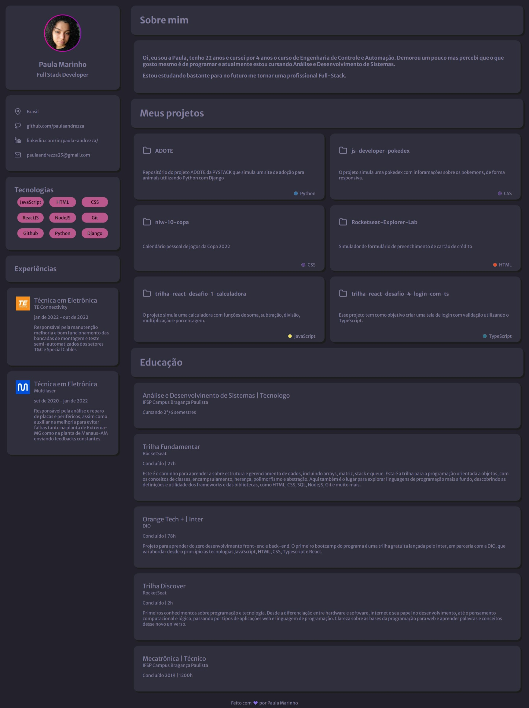

<h1 align="center"> Portfólio </h1>

Meu primeiro portfólio

  <a href="#-tecnologias">Tecnologias</a>&nbsp;&nbsp;&nbsp;|&nbsp;&nbsp;&nbsp;
  <a href="#-projeto">Projeto</a>&nbsp;&nbsp;&nbsp;|&nbsp;&nbsp;&nbsp;
  <a href="#-layout">Layout</a>

 

  

## 🚀 Tecnologias

Esse projeto foi desenvolvido com as seguintes tecnologias:

- HTML e CSS
- JavaScript
- Git e Github

## 💻 Projeto

Esse projeto tem como objetivo a criação do meu primeiro portfólio que mostra algumas informações sobre mim, tecnologias que conheço e alguns repositórios do github. Você pode vê-lo [clicando aqui](https://paulaandrezza.github.io/Portfolio/).

## 🔖 Layout

O projeto foi baseado no layout disponibilizado pela RocketSeat, você pode visualizar o layout do projeto através [DESSE LINK](https://www.figma.com/file/iq7Qd64Dub3hqXZFbk2jJx/DD-%2F-Portfolio-(Copy)?node-id=3%3A2&t=2SgdKXF9q7jyv0Fh-0/duplicate). É necessário ter conta no [Figma](https://figma.com) para acessá-lo.

---

Feito com ♥ by Rocketseat :wave: [Participe da nossa comunidade!](https://discord.gg/rocketseat)